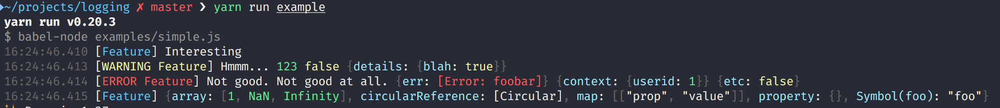

# Logging [](https://github.com/dylang/logging/actions/workflows/test.yml)

> Lightweight informative modern console logging.

[](screenshots/screenshot.png)

## Install

```sh
pnpm add logging
```

## Features
* Simple.
* Log levels.
* Nice coloring.

## Usage

```js
// ESM only
import createLogger from 'logging';

const logger = createLogger('Feature');

logger.info('Interesting');
// -> [ Feature ] Interesting

logger.warn('Hmmm...', { details });
// -> [ WARNING Feature ] Hmmm... { details object }

logger.error('Not good.', 'Not good at all.', { err }, { context }, { etc });
// -> [ ERROR Feature ] Not good. Not good at all. { err } { context } ...

// uses the debug module, use DEBUG=* or DEBUG=FeatureName to see these items.
logger.debug('Interesting');
// -> [ Feature ] Interesting
```
